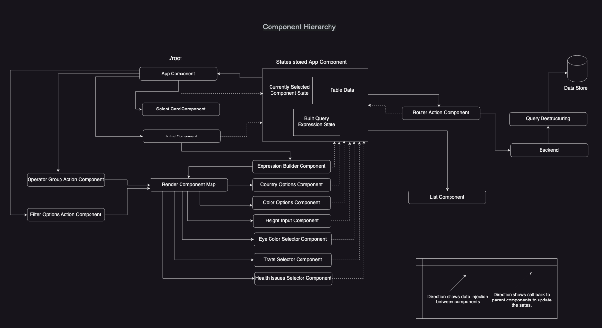

# Boolean Search App

- This project was built using React and TypeScript to build a logical search system that allows users to find a dog breed using a set criteria with AND/OR operators.
- Project is not connected to any backend, instead used a in-app search call to filter out JSON data of dog-breeds and pass a JSON response with resulting breeds having country of origin 'England' or 'France' to the frontend.

## To run this project

- Save the package in the desired location.
- Inside the directory, you can run: `npm start`.
- Open [http://localhost:3000](http://localhost:3000) to view it in the browser.
- start building the expression.
  - Start with the opertor first. select any on the Boolean Operator.
  - Then select any Filter categories button to add it in as operands to the expression.
  - Nested Expressions - you can also add more operators as operands to build more complex nested expression.
- Once you have completed building the expression click on send request button go to the console and see the expression being sent(you might have to search a little to find it look for `calling backend...! Sending this query Array`)
- After the reposnce is recived you will see the breeds table being displayed as cards.
- Change the pages to see more data.

## Features Catered

- Search system that builds complex search expressions based on user selected option.
- Gives user the ability to build nested quries.
- Onclick action button that add filter categories and boolean operators in the expression.
- Build Complex expressions.
  - select-and-change: user can click on the operands of expression and - Adding new categories as operands to the expression by clicking on the add button. - Deleting existing operands in the expression by clicking on the delete button. - Updating values in the built expression using dropdown in operators and operands - Send it to a mock in-app backend
- Backend runs a search using on dog-breeds-JSON data and filter out cases using a mock simple expression and sends back the search response.
- The search response is recived by the frontend and the search response is displayes as a list of cards.
- Paginate the response and show selected pre-defined iteams in one page (for this project iteams per pages is set to 5).

- Features TO-DO:
- Deleting Nexted expressions: in this version users can only delete from filter categories.
- Display the built expression on the screen.
- Remove the mock search and build a intime search.
- Save the state of the expression. currently the expression is lost on a page load.

### Architecture



###List of Components.

- App Component: This is the main root component and all the other components update the state of QueryExpression and CurrentSelected by making call back to App component.
- Select Card Component: This is a button component, when a user clicks on the button that is recorder at the App component.
- Initial Component: This is the first component that gets rengered on the screen when the user click on the operators.
- Operator Button Groups: These are Click on Action buttons, which update the expression with the selected operator.
- Filter Options Button Group: Thease are Click on Action buttons, which update the expression based on which Operand whas selected by the user.
- Country Options Component: Renders the Country Component on DOM when this option is clicked.
- Color Options Component: Renders the Color Component on DOM when this option is clicked.
- Height Options Component: : Renders the Height Component on DOM when this option is clicked.
- Eye Color Options Component: Renders the Traits Component on DOM when this option is clicked.
- Traits Options Component: Renders the Eye Color Component on DOM when this option is clicked.
- Health Issues Options Component: Renders the Health Issues Component on DOM when this option is clicked.
- Router Button: After the expession is complete onclick the user can send that expression to the backend.
- List Component with Paginator: Renders the List Component on DOM when the data is recived and applies pagination to the data.
- Sample Built Expression:

The expressions are built as array of objects which one holding one layer of the expression i.e( ). To preserver the order, as as new operators get add, a unique identifier gets strored in the operend.value pointing to the next expression id that holds the complete expression to follow the stacking rules. Below shows a built sample expression which gets sent to the backend in request header.

```
Sample Built Expression Structure
[
    {
        "Id": 1,
        "type": "Expression",
        "operator": "OR",
        "operand": [
            {
                "operendType": "Contry",
                "expId": 1
                "opId": 0,
                "value": ["England"]
            },
            {
                "operendType": "Contry",
                "expId": 1
                "opId": 1,
                "value": ["France"]
            }
        ]
    }
        {
        "Id": 0,
        "type": "Expression",
        "operator": "AND",
        "operand": [
            {
                "operendType": "Contry",
                "expId": 0
                "opId": 0,
                "value": ["USA"]
            },
            {
                "operendType": "Expression",
                "expId": 0
                "opId": 1,
                "value": ["1"]
            }
        ]
    }
]
```

##### Author: Zahid Shaik(zahidshaik01@gmail.com)
